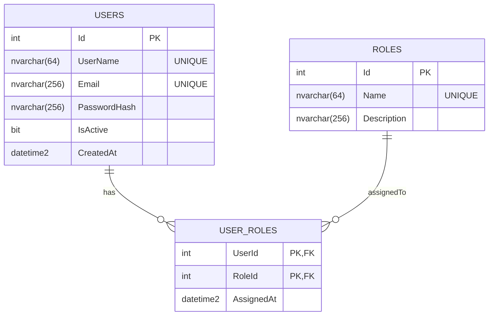

# Step 2 — Domain Entities

## Goal
Define the three database tables as plain C# classes with no framework dependencies.

## Entities

### User
```
Id           int (auto-increment, PK)
UserName     string (unique, max 64)
Email        string (unique, max 256)
PasswordHash string (BCrypt hash, max 256)
IsActive     bool
CreatedAt    DateTime
```

### Role
```
Id           int (auto-increment, PK)
Name         string (unique, max 64)
Description  string (optional)
```

### UserRole (join table)
```
UserId       int (FK → User, composite PK)
RoleId       int (FK → Role, composite PK)
AssignedAt   DateTime
```

## Entity-relationship diagram



## Key decisions

- **`int` IDs** instead of GUIDs — simpler, smaller indexes, readable in URLs and logs.
- **`UserRole` is explicit** (not EF's implicit many-to-many) so we can store `AssignedAt` and query it directly.
- **Passwords never stored plain** — only the BCrypt hash is persisted. The original password cannot be recovered from it.

## Key files

- [src/FymUsers.Domain/Entities/User.cs](src/FymUsers.Domain/Entities/User.cs)
- [src/FymUsers.Domain/Entities/Role.cs](src/FymUsers.Domain/Entities/Role.cs)
- [src/FymUsers.Domain/Entities/UserRole.cs](src/FymUsers.Domain/Entities/UserRole.cs)
