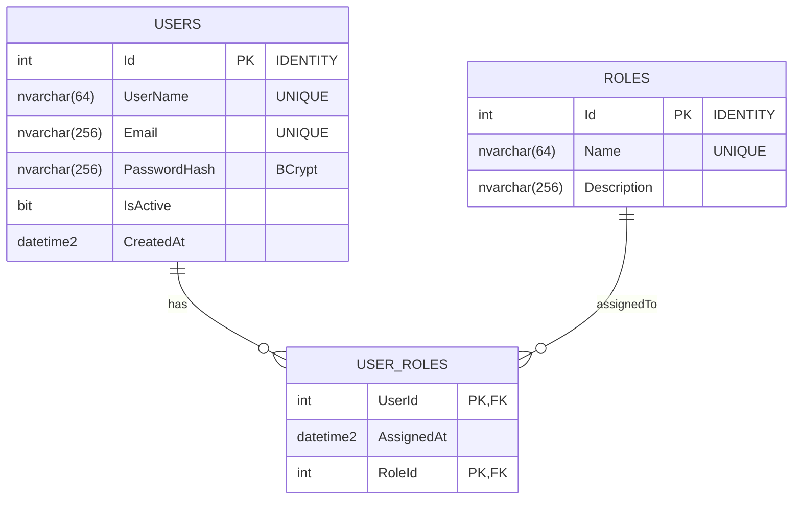

# FymUsers — API de Usuarios y Roles (Prueba técnica senior FYM Technology)

API REST para gestión de usuarios y roles, con autenticación basada en JWT y un cliente React.
Desarrollada según la especificación de la prueba técnica senior de FYM Technology.

## Stack

- **API** — ASP.NET Core 8 (C#), EF Core 8, Swashbuckle (Swagger), BCrypt.Net para hashing de contraseñas, autenticación JWT Bearer.
- **Base de datos** — SQL Server 2022. La conexión usa `Encrypt=True`.
- **Cliente** — React 19 + TypeScript + Vite 6 + axios + react-router-dom.

## Estructura del proyecto

```
TEST/
  FymUsers.sln
  src/
    FymUsers.Api/                 ASP.NET Core Web API (controladores, JWT, Swagger, DI)
    FymUsers.Domain/              Entidades (User, Role, UserRole)
    FymUsers.Infrastructure/      EF Core DbContext + migraciones
  client/                         Cliente React (Vite + TS)
  README.md
```

## Modelo entidad-relación



`USER_ROLES` es una tabla de unión muchos-a-muchos con clave primaria compuesta `(UserId, RoleId)`.
El borrado en cascada está habilitado en `User → UserRoles`; borrar un `Role` está restringido para evitar usuarios huérfanos.

Datos iniciales creados en el primer arranque:

| Rol          | Id | Notas                                              |
|--------------|----|----------------------------------------------------|
| `SuperAdmin` | 1  | Puede crear usuarios y asignar roles               |
| `Admin`      | 2  | Administra usuarios y roles                        |
| `User`       | 3  | Usuario autenticado estándar                       |

Super administrador pre-creado al iniciar por primera vez:

- **Usuario**: `superadmin`
- **Contraseña**: `SuperAdmin123!`
- **Email**: `superadmin@fym.local`

## Prerrequisitos

- .NET 8 SDK
- SQL Server 2022 instalado y en ejecución
- Node.js 20.19+ o 22+ (para el cliente)

## Inicio rápido

### 1. Configurar la conexión a SQL Server

Editar `src/FymUsers.Api/appsettings.json` y ajustar la cadena de conexión según la instancia local de SQL Server:

```json
"ConnectionStrings": {
  "Default": "Server=localhost,1433;Database=FymUsers;User Id=sa;Password=<tu-contraseña>;Encrypt=True;TrustServerCertificate=True;"
}
```

Los parámetros a ajustar son `Server`, `User Id` y `Password`. La base de datos `FymUsers` se crea automáticamente al levantar la API.

### 2. Levantar la API

La API aplica las migraciones de EF Core y crea el super administrador automáticamente al arrancar.

```bash
dotnet run --project src/FymUsers.Api --urls http://localhost:5080
```

- Swagger UI: <http://localhost:5080/swagger>
- La raíz `/` redirige a Swagger.

### 3. Levantar el cliente React

```bash
cd client
npm install
npm run dev
```

Abrir <http://localhost:5173>. El formulario de login viene pre-relleno con las credenciales del seed.

## Despliegue

### 1. Base de datos

Asegurarse de que SQL Server está corriendo y que la cadena de conexión apunta a la instancia correcta (ver sección anterior).

La API aplica las migraciones de EF Core automáticamente al iniciar — no se requiere ningún paso manual de esquema. Si se prefiere aplicar el esquema manualmente antes de arrancar la API:

```bash
dotnet tool install --global dotnet-ef          # omitir si ya está instalado
dotnet ef database update --project src/FymUsers.Infrastructure \
                           --startup-project src/FymUsers.Api
```

### 2. Servicio de la API

Compilar el binario de release:

```bash
dotnet publish src/FymUsers.Api -c Release -o ./publish
```

Definir las variables de entorno para mantener los secretos fuera de `appsettings.json`:

```bash
export ConnectionStrings__Default="Server=<host>,1433;Database=FymUsers;User Id=sa;Password=<contraseña>;Encrypt=True;TrustServerCertificate=True;"
export Jwt__SigningKey="<clave-secreta-minimo-32-caracteres>"
export Jwt__Issuer="FymUsers.Api"
export Jwt__Audience="FymUsers.Client"
```

Ejecutar la API publicada:

```bash
dotnet ./publish/FymUsers.Api.dll --urls http://0.0.0.0:5080
```

La API aplicará las migraciones pendientes y creará el super administrador en el primer arranque, luego comenzará a escuchar en el puerto `5080`. Swagger disponible en `/swagger`.

## Esquema de base de datos

El esquema se aplica automáticamente mediante EF Core Migrations. A continuación se incluyen los scripts equivalentes en T-SQL para referencia:

```sql
-- Crear la base de datos
CREATE DATABASE FymUsers;
GO

USE FymUsers;
GO

-- Tabla: Roles
CREATE TABLE Roles (
    Id          INT IDENTITY(1,1) NOT NULL,
    Name        NVARCHAR(64)  NOT NULL,
    Description NVARCHAR(256) NULL,
    CONSTRAINT PK_Roles PRIMARY KEY (Id)
);
CREATE UNIQUE INDEX IX_Roles_Name ON Roles (Name);

-- Tabla: Users
CREATE TABLE Users (
    Id           INT IDENTITY(1,1) NOT NULL,
    UserName     NVARCHAR(64)  NOT NULL,
    Email        NVARCHAR(256) NOT NULL,
    PasswordHash NVARCHAR(256) NOT NULL,
    IsActive     BIT           NOT NULL,
    CreatedAt    DATETIME2     NOT NULL,
    CONSTRAINT PK_Users PRIMARY KEY (Id)
);
CREATE UNIQUE INDEX IX_Users_UserName ON Users (UserName);
CREATE UNIQUE INDEX IX_Users_Email    ON Users (Email);

-- Tabla: UserRoles
CREATE TABLE UserRoles (
    UserId     INT       NOT NULL,
    RoleId     INT       NOT NULL,
    AssignedAt DATETIME2 NOT NULL,
    CONSTRAINT PK_UserRoles      PRIMARY KEY (UserId, RoleId),
    CONSTRAINT FK_UserRoles_Users FOREIGN KEY (UserId) REFERENCES Users (Id) ON DELETE CASCADE,
    CONSTRAINT FK_UserRoles_Roles FOREIGN KEY (RoleId) REFERENCES Roles (Id) ON DELETE NO ACTION
);
CREATE INDEX IX_UserRoles_RoleId ON UserRoles (RoleId);

-- Datos iniciales de roles
INSERT INTO Roles (Id, Name, Description) VALUES
    (1, 'SuperAdmin', 'Acceso completo al sistema; puede crear usuarios.'),
    (2, 'Admin',      'Administra usuarios y roles.'),
    (3, 'User',       'Usuario autenticado estándar.');
```

## Endpoints de la API

Todos los endpoints están documentados y son ejecutables desde Swagger (`/swagger`). El JWT se puede suministrar mediante el botón **Authorize**.

| Método | Ruta                           | Autenticación       | Descripción                                          |
|--------|--------------------------------|---------------------|------------------------------------------------------|
| POST   | `/api/auth/login`              | Anónimo             | Devuelve JWT + perfil de usuario                     |
| GET    | `/api/users`                   | Cualquier usuario   | Lista todos los usuarios con sus roles               |
| GET    | `/api/users/me`                | Cualquier usuario   | Perfil del usuario autenticado                       |
| GET    | `/api/users/{id}`              | Cualquier usuario   | Obtiene un usuario por id                            |
| POST   | `/api/users`                   | Solo `SuperAdmin`   | Crea un nuevo usuario (opcionalmente con roles)      |
| POST   | `/api/users/{id}/roles`        | Solo `SuperAdmin`   | Asigna uno o más roles a un usuario                  |
| GET    | `/api/roles`                   | Cualquier usuario   | Lista todos los roles                                |

### Ejemplos de peticiones

```bash
# 1. Login como superadmin
TOKEN=$(curl -s -X POST http://localhost:5080/api/auth/login \
  -H "Content-Type: application/json" \
  -d '{"userName":"superadmin","password":"SuperAdmin123!"}' \
  | jq -r .accessToken)

# 2. Listar roles
curl -s http://localhost:5080/api/roles -H "Authorization: Bearer $TOKEN" | jq

# 3. Crear un nuevo usuario con el rol "User"
curl -s -X POST http://localhost:5080/api/users \
  -H "Authorization: Bearer $TOKEN" \
  -H "Content-Type: application/json" \
  -d '{
    "userName":"alice",
    "email":"alice@example.com",
    "password":"Alice123!@#",
    "roleIds":[3]
  }' | jq
```

## Notas de seguridad

- Las contraseñas se almacenan como hashes **BCrypt** (factor de trabajo 11). Nunca son devueltas por la API.
- El JWT está firmado con **HMAC-SHA256**. Se validan el emisor, audiencia, tiempo de vida y clave de firma.
- `POST /api/users` y `POST /api/users/{id}/roles` están protegidos por `[Authorize(Roles = "SuperAdmin")]`.
- La cadena de conexión usa `Encrypt=True;TrustServerCertificate=True`. En un entorno real se debería usar `TrustServerCertificate=False` con un certificado emitido por una CA.
- El `ExceptionHandlingMiddleware` global convierte tanto las excepciones esperadas (`DomainException`) como las inesperadas en respuestas `application/problem+json` RFC 7807 con códigos HTTP estables (400/401/404/409/500).
- CORS está restringido a `http://localhost:5173` (el origen de Vite en desarrollo).

## Consideraciones para producción (no implementadas en la prueba)

- Mover `Jwt:SigningKey`, la contraseña de SQL Server y la contraseña del super administrador a un gestor de secretos (`dotnet user-secrets`, variables de entorno, Azure Key Vault…).
- Usar un certificado TLS emitido por una CA real en SQL Server para que `TrustServerCertificate=False` sea seguro.
- Añadir refresh tokens y revocación de tokens.
- Añadir validación de peticiones con FluentValidation (actualmente usando `DataAnnotations`).
- Añadir rate limiting en `/api/auth/login`.
- Contenerizar la API y usar Docker Compose para levantar API + BD juntos.

## Reiniciar la base de datos

Ejecutar el siguiente comando en SQL Server para eliminar la base de datos:

```sql
DROP DATABASE FymUsers;
```

El próximo `dotnet run` recreará el esquema y los datos iniciales.
