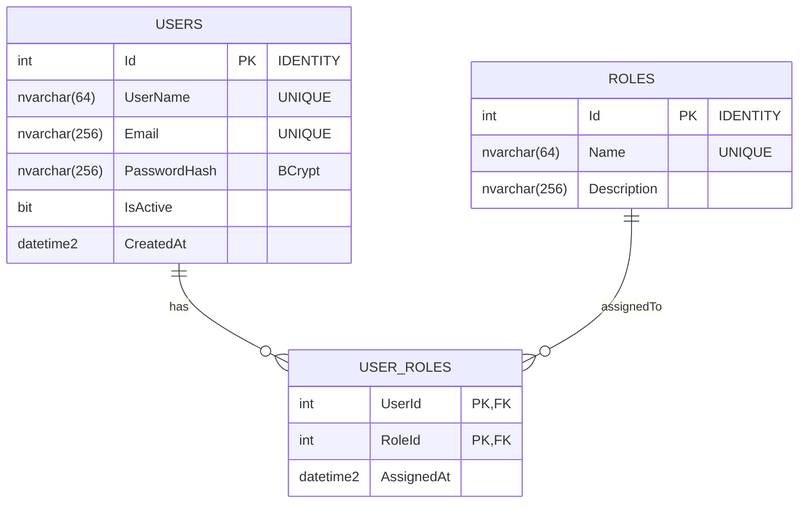

# FymUsers — Users & Roles API (FYM Technology senior dev test)

A REST API for managing users and roles, with JWT-based authentication and a React client.
Built per the FYM senior developer test specification.

## Stack

- **API** — ASP.NET Core 8 (C#), EF Core 8, Swashbuckle (Swagger), BCrypt.Net for password hashing, JWT Bearer auth.
- **Database** — SQL Server 2022 (on macOS Apple Silicon, falls back to `azure-sql-edge` because SQL Server 2022 segfaults under QEMU emulation in Rancher Desktop). Connection uses `Encrypt=True`.
- **Client** — React 19 + TypeScript + Vite 6 + axios + react-router-dom.

## Project layout

```
TEST/
  FymUsers.sln
  src/
    FymUsers.Api/                 ASP.NET Core Web API (controllers, JWT, Swagger, DI)
    FymUsers.Domain/              Entity classes (User, Role, UserRole)
    FymUsers.Infrastructure/      EF Core DbContext + migrations
  client/                         React (Vite + TS) client
  README.md
```

## Entity-relationship model



The `USER_ROLES` table is a many-to-many join with a composite primary key `(UserId, RoleId)`.
Cascade delete is enabled on `User → UserRoles`; deleting a `Role` is restricted to prevent orphaning users.

Seed data (created on first run):

| Role         | Id | Notes                                              |
|--------------|----|----------------------------------------------------|
| `SuperAdmin` | 1  | Can create users and assign roles                  |
| `Admin`      | 2  | Manages users and roles                            |
| `User`       | 3  | Standard authenticated user                        |

A pre-created super administrator is inserted on first startup:

- **Username**: `superadmin`
- **Password**: `SuperAdmin123!`
- **Email**: `superadmin@fym.local`

## Prerequisites

- .NET 8 SDK
- Docker (Docker Desktop, Rancher Desktop, OrbStack, etc.)
- Node.js 20.19+ or 22+ (for the client)

## Quick start

### 1. Start SQL Server

On Apple Silicon (Mac M-chip), use `azure-sql-edge` — it is ARM64-native and does not segfault:

```bash
docker run -d --name fym-mssql \
  -e "ACCEPT_EULA=1" \
  -e "MSSQL_SA_PASSWORD=YourStrong!Passw0rd" \
  -p 1433:1433 \
  mcr.microsoft.com/azure-sql-edge:latest
```

On Linux / Windows / Intel Mac, the official image works too:

```bash
docker run -d --name fym-mssql \
  -e "ACCEPT_EULA=Y" \
  -e "MSSQL_SA_PASSWORD=YourStrong!Passw0rd" \
  -e "MSSQL_PID=Developer" \
  -p 1433:1433 \
  mcr.microsoft.com/mssql/server:2022-latest
```

### 2. Run the API

The API applies EF Core migrations and seeds the super-admin user automatically on startup.

```bash
dotnet run --project src/FymUsers.Api --urls http://localhost:5080
```

- Swagger UI: <http://localhost:5080/swagger>
- Root `/` redirects to Swagger.

### 3. Run the React client

```bash
cd client
npm install
npm run dev
```

Open <http://localhost:5173>. Pre-filled login form uses the seed credentials.

## API surface

All endpoints are documented and testable through Swagger (`/swagger`). JWT can be supplied via the **Authorize** button.

| Method | Route                          | Auth                | Description                                      |
|--------|--------------------------------|---------------------|--------------------------------------------------|
| POST   | `/api/auth/login`              | Anonymous           | Returns JWT + user profile                       |
| GET    | `/api/users`                   | Any authenticated   | List all users with their roles                  |
| GET    | `/api/users/me`                | Any authenticated   | Current user's profile                           |
| GET    | `/api/users/{id}`              | Any authenticated   | Get a user by id                                 |
| POST   | `/api/users`                   | `SuperAdmin` only   | Create a new user (optionally with role ids)     |
| POST   | `/api/users/{id}/roles`        | `SuperAdmin` only   | Assign one or more roles to a user               |
| GET    | `/api/roles`                   | Any authenticated   | List all roles                                   |

### Sample requests

```bash
# 1. Login as superadmin
TOKEN=$(curl -s -X POST http://localhost:5080/api/auth/login \
  -H "Content-Type: application/json" \
  -d '{"userName":"superadmin","password":"SuperAdmin123!"}' \
  | jq -r .accessToken)

# 2. List roles
curl -s http://localhost:5080/api/roles -H "Authorization: Bearer $TOKEN" | jq

# 3. Create a new user with the "User" role
curl -s -X POST http://localhost:5080/api/users \
  -H "Authorization: Bearer $TOKEN" \
  -H "Content-Type: application/json" \
  -d '{
    "userName":"alice",
    "email":"alice@example.com",
    "password":"Alice123!@#",
    "roleIds":[3]
  }' | jq
```

## Security notes

- Passwords are stored as **BCrypt** hashes (work factor 11). They are never returned by the API.
- JWT is signed with **HMAC-SHA256**. Issuer, audience, lifetime, and signing key are all validated.
- `POST /api/users` and `POST /api/users/{id}/roles` are gated by `[Authorize(Roles = "SuperAdmin")]`.
- Connection string sets `Encrypt=True;TrustServerCertificate=True` per the requirement that the DB connection be encrypted. In a real environment `TrustServerCertificate=False` plus a CA-issued cert should be used.
- Global `ExceptionHandlingMiddleware` converts both expected (`DomainException`) and unexpected exceptions into RFC 7807 `application/problem+json` responses with stable HTTP status codes (400/401/404/409/500).
- CORS is restricted to `http://localhost:5173` (the Vite dev origin).

## Production hardening (not implemented for the test, listed for completeness)

- Move `Jwt:SigningKey`, `MSSQL_SA_PASSWORD`, and the seed-admin password to a secret store (`dotnet user-secrets`, environment variables, Azure Key Vault…).
- Use a real CA-issued TLS certificate on SQL Server so `TrustServerCertificate=False` is safe.
- Add refresh tokens / token revocation.
- Add request validation via FluentValidation (currently using `DataAnnotations`).
- Add rate limiting on `/api/auth/login`.
- Containerise the API and use compose to bring up API + DB together.

## Resetting the database

```bash
docker exec fym-mssql /opt/mssql-tools18/bin/sqlcmd -S localhost -U sa -P 'YourStrong!Passw0rd' -C -Q "DROP DATABASE FymUsers;"
# OR just nuke the container
docker rm -f fym-mssql && <re-run the docker run command above>
```

The next `dotnet run` will recreate the schema and seed data.
# fym-test-fullstack
